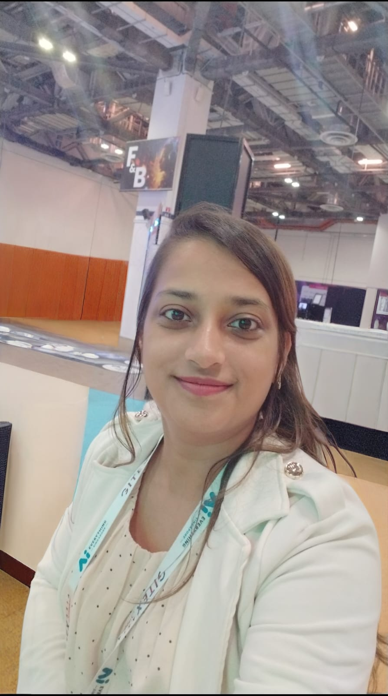

# Hetal Kothari | Cloud Engineer

[About Me](#about-me) | [Skills](#skills) | [Projects](#projects)

---

### **Technical Core Competencies**
* **Cloud Platforms:** AWS Microsoft Azure AKS
* **AI/ML:** Azure OpenAI Azure AI Search
* **Security:** Azure WAF SSL/TLS
# Hetal Kothari | Cloud Support Engineer

[About Me](#about-me) | [Skills](#skills) | [Projects](#projects)

---

### **Professional Summary**
Cloud Support Engineer specializing in designing and managing scalable, high-availability infrastructure across **AWS** and **Microsoft Azure**.

Expertise in bridging the gap between traditional cloud architecture and **Generative AI** to enhance user experiences.

Proven track record in implementing robust DevOps and security frameworks, including **WAF, SSL/TLS**, and automated scaling.

---

### **Technical Core Competencies**
* **Cloud Platforms:** AWS Microsoft Azure App Service AKS Front Door
* **AI/ML:** Azure OpenAI (LLMs) Azure AI Search GenAI Integration
* **Security & Compliance:** Azure WAF Key Vault SQL TDE Encryption SSL/TLS
* **Infrastructure & DevOps:** Kubernetes Auto-scaling Git/GitHub Microservices

---

### **Featured Project: AI-Assisted Luxury E-Commerce**

* **Architected and deployed** a high-performance e-commerce platform on Azure specifically designed for the luxury retail market.
* **Integrated Generative AI** using Azure OpenAI to provide "white-glove" personalized shopping experiences and intelligent recommendations.
* **Orchestrated Scalability** by utilizing Azure Kubernetes Service (AKS) and Horizontal Auto-scaling to maintain performance during traffic surges.
* **Hardened System Security** by implementing Azure WAF and Key Vault, ensuring the protection of high-value customer data.
* **Optimized Global Delivery** through Azure Front Door, ensuring low-latency access and high availability.

---

**Project Link**: https://hetalkothari.pythonanywhere.com/

**LinkedIn**: https://www.linkedin.com/in/hetal-kothari-104a31274/
